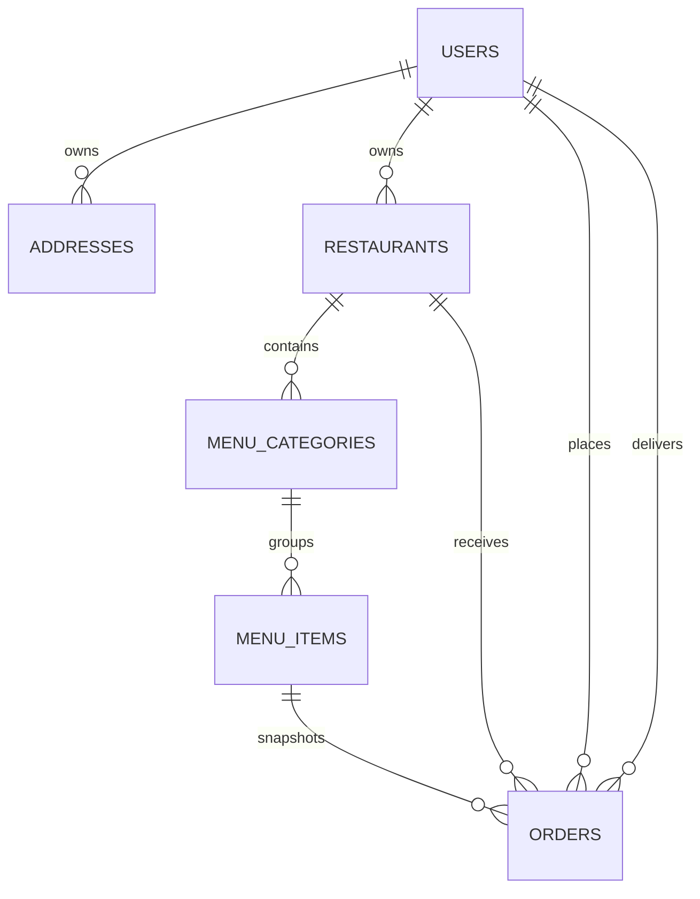

# Tomato_clone Database Design

This design supports Tomato as an online food-ordering and delivery platform. It does not include physical dining tables, table reservations, or dine-in operations.

## Collections

### `users`

Stores the four application account categories: customers, restaurants, delivery partners, and admins.

```json
{
  "_id": "ObjectId",
  "name": "Aman Raj",
  "email": "aman@example.com",
  "passwordHash": "salt:derived-key",
  "phone": "+91...",
  "image": "https://...",
  "role": "customer",
  "isActive": true,
  "createdAt": "Date",
  "updatedAt": "Date"
}
```

Allowed roles: `customer`, `restaurant`, `deliveryPartner`, `admin`.

Registration accepts one of the allowed roles. Production deployments should add approval and protected onboarding controls for restaurant, delivery-partner, and admin accounts.

Indexes:

- Unique `{ email: 1 }`
- Unique sparse `{ phone: 1 }`
- `{ role: 1, isActive: 1 }`

Registration and login accept either `email` or `phone`. At least one contact identifier is required; both may be stored when available.

Passwords are stored only as salted hashes. Never store plaintext passwords or return `passwordHash` in API responses.

### `restaurants`

Stores restaurant profiles managed by staff.

```json
{
  "_id": "ObjectId",
  "name": "Tomato Kitchen",
  "slug": "tomato-kitchen",
  "description": "Fresh seasonal plates",
  "image": "https://...",
  "phone": "+91...",
  "address": {
    "line1": "12 Market Road",
    "city": "Bengaluru",
    "postalCode": "560001",
    "location": { "type": "Point", "coordinates": [77.5946, 12.9716] }
  },
  "openingHours": [{ "day": 1, "open": "09:00", "close": "23:00" }],
  "isOpen": true,
  "ownerId": "ObjectId -> users (role: restaurant)",
  "createdAt": "Date",
  "updatedAt": "Date"
}
```

Indexes:

- Unique `{ slug: 1 }`
- `2dsphere` index on `address.location`
- `{ ownerId: 1 }`

### `menu_categories`

Groups menu items for a restaurant.

```json
{
  "_id": "ObjectId",
  "restaurantId": "ObjectId -> restaurants",
  "name": "Main Course",
  "sortOrder": 2,
  "isActive": true,
  "createdAt": "Date",
  "updatedAt": "Date"
}
```

Indexes:

- Unique compound `{ restaurantId: 1, name: 1 }`
- `{ restaurantId: 1, sortOrder: 1 }`

### `menu_items`

Stores dishes customers can order.

```json
{
  "_id": "ObjectId",
  "restaurantId": "ObjectId -> restaurants",
  "categoryId": "ObjectId -> menu_categories",
  "name": "Paneer Tikka",
  "description": "Chargrilled paneer with peppers",
  "image": "https://...",
  "price": 249,
  "currency": "INR",
  "dietaryTags": ["vegetarian"],
  "isAvailable": true,
  "sortOrder": 1,
  "createdAt": "Date",
  "updatedAt": "Date"
}
```

Indexes:

- `{ restaurantId: 1, categoryId: 1, isAvailable: 1, sortOrder: 1 }`
- `{ restaurantId: 1, name: 1 }`

Prices should be stored as integer minor units in production if fractional currency values are needed. For INR whole-rupee prices, the `price` example is sufficient.

### `addresses`

Stores reusable customer delivery addresses.

```json
{
  "_id": "ObjectId",
  "userId": "ObjectId -> users",
  "label": "Home",
  "phone": "+919900000001",
  "line1": "44 Lake View Road",
  "line2": "Apartment 5B",
  "city": "Bengaluru",
  "postalCode": "560001",
  "location": { "type": "Point", "coordinates": [77.5946, 12.9716] },
  "isDefault": true,
  "createdAt": "Date",
  "updatedAt": "Date"
}
```

Indexes:

- `{ userId: 1, isDefault: 1 }`
- `2dsphere` index on `location`

`addresses.phone` is an optional delivery contact number. It can differ from the account phone when a customer wants the rider to call another person at the delivery location.

There is intentionally no `dining_tables` collection because Tomato operates online only. Delivery addresses and order delivery status are the relevant customer-location data.

### `orders`

Stores the order lifecycle and an immutable snapshot of purchased items.

```json
{
  "_id": "ObjectId",
  "orderNumber": "TOM-20260906-0001",
  "customerId": "ObjectId -> users",
  "restaurantId": "ObjectId -> restaurants",
  "deliveryPartnerId": "ObjectId -> users (role: deliveryPartner)",
  "items": [
    {
      "menuItemId": "ObjectId -> menu_items",
      "name": "Paneer Tikka",
      "quantity": 2,
      "unitPrice": 249,
      "totalPrice": 498,
      "notes": "Less spicy"
    }
  ],
  "deliveryAddress": {
    "phone": "+919900000001",
    "line1": "44 Lake View Road",
    "city": "Bengaluru",
    "postalCode": "560001",
    "location": { "type": "Point", "coordinates": [77.5946, 12.9716] }
  },
  "subtotal": 498,
  "deliveryFee": 40,
  "tax": 27,
  "total": 565,
  "paymentStatus": "pending",
  "paymentMethod": "cash",
  "status": "placed",
  "statusHistory": [
    { "status": "placed", "at": "Date", "by": "ObjectId -> users" }
  ],
  "createdAt": "Date",
  "updatedAt": "Date"
}
```

Indexes:

- Unique `{ orderNumber: 1 }`
- `{ customerId: 1, createdAt: -1 }`
- `{ restaurantId: 1, status: 1, createdAt: -1 }`
- `{ deliveryPartnerId: 1, status: 1, updatedAt: -1 }`

Order item names and prices are snapshots. Do not calculate historical orders from the current `menu_items` document because menu prices and names can change.

Allowed order statuses:

```text
placed -> confirmed -> preparing -> ready_for_pickup -> picked_up -> delivered
placed -> cancelled
confirmed -> cancelled
```

Allowed payment statuses: `pending`, `paid`, `failed`, `refunded`.

## Relationships



References use MongoDB `ObjectId`. Order documents intentionally embed item and address snapshots so receipts remain correct even when source records change.

## Authentication boundary

The auth service currently owns `users` and should expose only public user fields to clients:

```text
_id, name, email, image, role, isActive, createdAt, updatedAt
```

The `passwordHash` field remains private to the auth service. Other services should trust a verified JWT or call an auth endpoint rather than reading password data.

## Recommended implementation order

1. Keep the current `users` collection with `customer`, `restaurant`, `deliveryPartner`, and `admin` roles.
2. Add restaurants and menu collections before building the customer ordering UI.
3. Add addresses and orders after menu browsing works.
4. Add payment records as a separate collection when an external payment provider is introduced.
5. Add audit logs for admin and restaurant-staff actions once those roles are active.

## MongoDB setup

The service selects this database through the environment:

```env
MONGO_DB_NAME=Tomato_clone
```

Mongoose creates collections when the first document is inserted. Indexes should be declared in each Mongoose schema and reviewed with MongoDB Atlas before production traffic.
